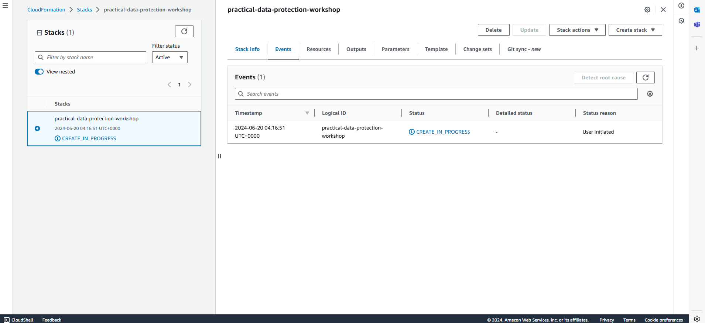
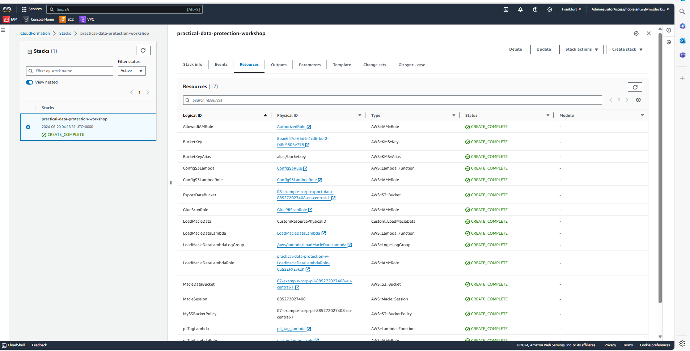
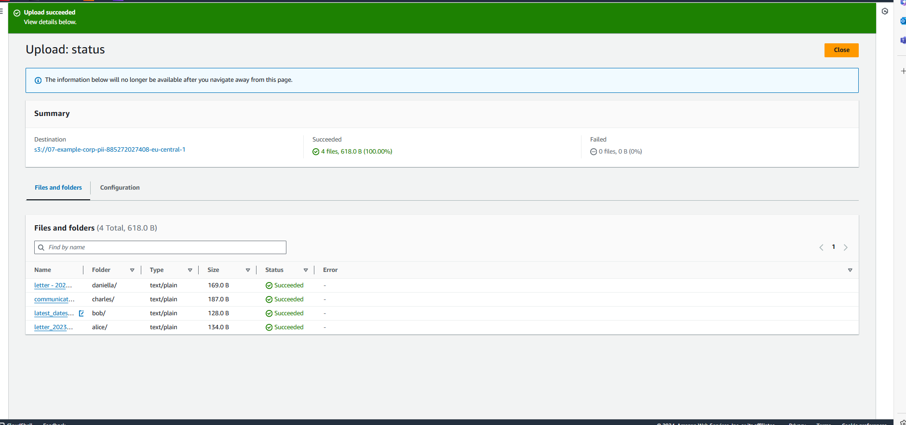
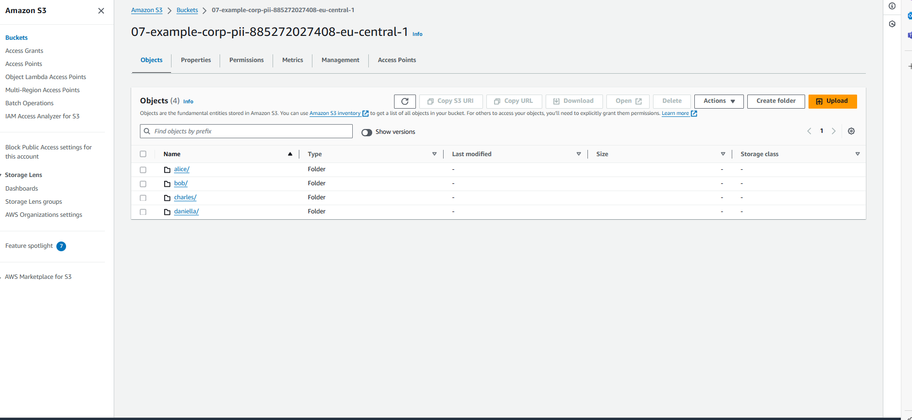
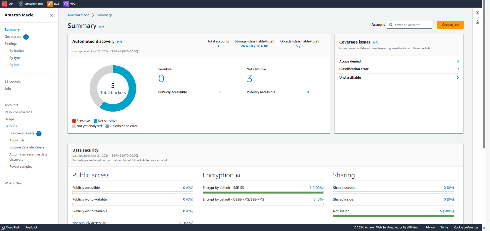
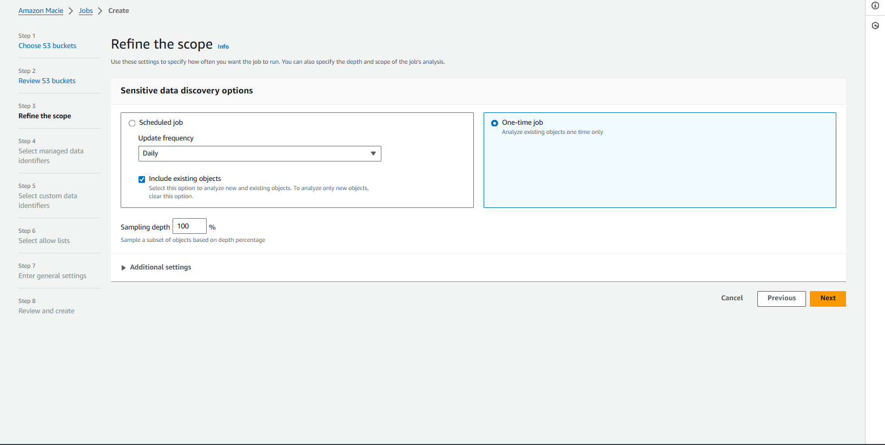
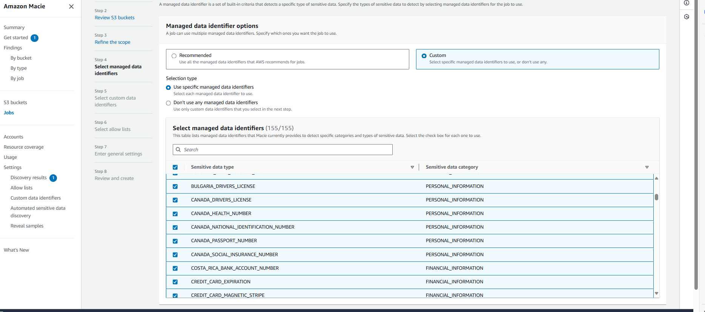
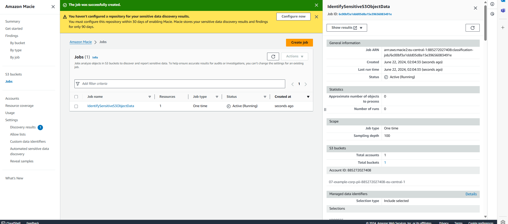

# Practical Data Protection and Risk Assessment for Sensitive Workloads

## Introduction

Welcome to a workshop designed to empower you with practical skills in safeguarding sensitive data within AWS environments. Throughout this journey, we'll delve into the intricacies of data protection, from risk assessment to the implementation of robust security controls using AWS services. This workshop is your gateway to mastering the art of mitigating business risks effectively while optimizing costs.

## Personalized Approach

As someone deeply committed to ensuring data security and compliance, I understand the challenges organizations face in protecting sensitive workloads. Over the years, I've navigated these challenges firsthand, honing my expertise in selecting and deploying the right tools to mitigate risks effectively.

## Step-by-Step Journey

1. **Understanding Your Risks**:
   - We'll start by conducting a thorough risk assessment tailored to your organization's specific needs. This foundational step involves identifying potential vulnerabilities and understanding their impact on your operations.

2. **Selecting Effective Controls**:
   - Drawing on real-world examples, we'll explore how to choose the most appropriate controls to mitigate identified risks. Whether it's leveraging AWS IAM for precise permissions or AWS KMS for robust encryption, you'll learn to align controls with your risk profile.

3. **Deploying with Precision**:
   - Hands-on sessions will guide you through the deployment and configuration of AWS services. From setting up encryption protocols to implementing multi-party processing solutions, you'll gain practical experience in securing sensitive data.

4. **Monitoring for Assurance**:
   - Learn the art of continuous monitoring using AWS CloudWatch and AWS Config. This crucial step ensures that your security measures remain effective over time, preparing you for audits and compliance requirements.

## Expected Outcomes

By the end of this workshop, you'll emerge not just with theoretical knowledge but with the confidence and capability to protect your organization's sensitive workloads effectively. Armed with practical skills and strategic insights, you'll be ready to navigate the dynamic landscape of data protection within AWS with clarity and purpose.

# CloudFormation Template Explanation

## Template Metadata and Description
- **AWSTemplateFormatVersion**: Specifies the version of the CloudFormation template format used (2010-09-09).
- **Description**: Provides a brief overview of the purpose of the CloudFormation template (`re:Invent 2023 - SEC247 - Practical Data Protection and Risk Assessment for sensitive workloads`).

## Parameters
- **awsevent**: A parameter to determine if the stack is being deployed at an AWS event (default: "Yes").
- **pPIITag**: A parameter specifying the tag key to identify Personally Identifiable Information (PII) in S3 objects (default: "PII").
- **AssetsBucketName**: Name of the S3 bucket that stores assets (default: "example-bucket").
- **AssetsBucketPrefix**: Prefix for the folder structure within the assets S3 bucket (default: "example-prefix").

## Resources
### AWS Macie Configuration
- **MacieSession**: Configures Amazon Macie session settings with a 15-minute finding publishing frequency.
- **MacieDataBucket**: Creates an S3 bucket for Amazon Macie, enabling encryption, versioning, and ownership controls. Policies ensure no public access.
- **MyS3BucketPolicy**: Defines a bucket policy that denies public access to objects tagged with specific PII tags.
- **LoadMacieData**: Custom resource to load mock data into the Macie-enabled S3 bucket upon stack creation.
- **LoadMacieDataLambdaRole**: IAM role for the Lambda function responsible for loading mock data into the Macie S3 bucket.
- **LoadMacieDataLambda**: Lambda function to load mock data into the Macie S3 bucket.
- **LoadMacieDataLambdaLogGroup**: CloudWatch Logs group for the LoadMacieData Lambda function.

### AWS Config and Compliance
- **ConfigS3LambdaRole**: IAM role for the Lambda function (ConfigS3Lambda) responsible for evaluating and enforcing S3 bucket compliance rules.
- **ConfigS3Lambda**: Lambda function (ConfigS3Lambda) to enforce S3 bucket encryption compliance using AWS Config.
- **AllowedIAMRole**: IAM role with permissions to access and classify objects within S3 buckets.

### AWS Lambda for PII Tagging
- **piiTagLambdaRole**: IAM role for the Lambda function responsible for tagging S3 objects with PII classification.
- **piiTagLambda**: Lambda function to tag S3 objects with PII classification based on event triggers.

### Glue Job and S3 Buckets
- **ExportDataBucket**: S3 bucket for Glue job data exports with encryption and versioning enabled.
- **SourceDataBucket**: S3 bucket for storing raw CSV files used in Glue jobs with encryption and versioning enabled.
- **GlueScanRole**: IAM role for Glue to access and manage data in the SourceDataBucket and ExportDataBucket.

### AWS KMS Keys
- **BucketKey**: AWS KMS Key used for encrypting data in S3 buckets.
- **BucketKeyAlias**: Alias for the AWS KMS Key (`alias/bucketkey`).

## Outputs
- **PIIS3Bucket**: Exports the name of the MacieDataBucket as an output.
- **SourceS3Bucket**: Exports the name of the SourceDataBucket as an output.
- **ExportS3Bucket**: Exports the name of the ExportDataBucket as an output.
- **BucketKey**: Exports the AWS KMS CMK used for encrypting S3 buckets.
- **BucketKeyAlias**: Exports the AWS KMS CMK alias used for encrypting S3 buckets.

The Cloud Formation Created a number of S3 buckets which are listed below
07-example-corp-pii-885272027408-eu-central-1
08-example-corp-export-data-885272027408-eu-central-1
08-example-corp-source-data-885272027408-eu-central-1
cf-templates-q4z4j090xej9-eu-central-1

In the 07-example-corp-pii-885272027408-eu-central-1  bucket, I uplodaded all the four files downloaded

## Permissions

In this project, I am implementing a robust workflow to proactively identify and secure sensitive data within our AWS environment. By leveraging Event Bridge and Step Functions, the focus is on automating the detection and management of personally identifiable information (PII), financial data, and credentials stored in Amazon S3 Buckets. This approach ensures compliance with stringent regulations and enhances data protection measures.

### Example Scenario: Example Corp.

Example Corp. is a credit card payment company entrusted with customer PII data stored in Amazon S3. Compliance requirements dictate meticulous control over this data within our AWS infrastructure.

Our goal is to automatically tag any object containing PII with a "PII" label, thereby elevating its protection status. Additionally, we're implementing Attribute Based Access Control (ABAC) through IAM policies linked to these tags. This ensures that only authorized personnel have access to these sensitive objects, adhering strictly to our security protocols.

This automated mechanism not only enhances our ability to detect sensitive data but also strengthens our overall data governance framework. It's a proactive step towards maintaining compliance and safeguarding sensitive information in a scalable manner.

## Verify the Sensitive Data and My Access

To start, I need to verify the sensitive data in my S3 bucket and ensure I have access to it. I log into the AWS Console and navigate to Services. From there, I choose Storage and then select S3. I locate the bucket named `07-example-corp-pii-885272027408-eu-central-1` and explore the folders and files inside. By verifying that I can access these files, I take some time to investigate the data contained within to ensure they are indeed the sensitive data I need to protect.

## Create the Amazon Macie Job

Next, I'll set up a job in Amazon Macie to detect sensitive data. I begin by clicking on Services at the top of my browser, selecting Security, Identity and Compliance, and then choosing Amazon Macie. 

Once in Amazon Macie, I click Create job. When prompted with "Are you sure that you want to create a job?", I confirm by clicking Yes. I choose to scan specific buckets and check the S3 bucket named `07-example-corp-pii-885272027408-eu-central-1`, then proceed to the next step.

After reviewing the selected S3 bucket, I move forward and choose to create a one-time job. For data identifiers, I opt for custom settings. I select "Use specific managed data identifiers" and check the box at the top next to "Sensitive data types" to include all 155 identifiers. 

I continue without adding custom data identifiers or allow lists. On the general settings page, I give the job the name, `IdentifySensitiveS3ObjectData`. After reviewing all settings, I submit the job, which initiates the Amazon Macie scan of my selected S3 buckets. The status of the job can be monitored in the Amazon Macie jobs console.

The Macie job takes about 10 minutes to complete. While it's running, I can proceed with the next steps in setting up the workflow, and review the Macie job results once it finishes.

